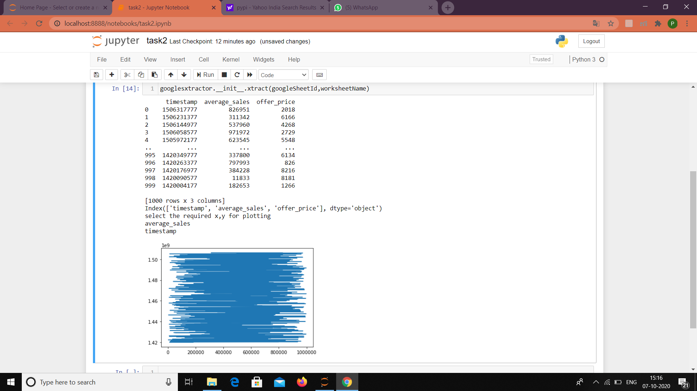

# greendeck-assignment2
# googlesxtractor 

Extracts data from google sheets and plots a chart with the values on the sheet.It prompts user  to select the required google sheet by askinga googlesheetid (which can be obtained from url) and also provides an option to select theattributes  for x-axis and y-axis by displaying all the columns available 

## Installation

Use `pip` to install the package

#### Python Version support
This package runs under python 3.6 and above versions and converting google sheet into csv file is made using PANDAS library

```
    $ pip install googlesxtractor
```

## Quickstart

Sign into the `Google Drive` with the your Google account
Open the googlesheet you want to access and get the googleSheet ID` from the link

### Example
> https://docs.google.com/spreadsheets/d/`1SrZfvr2ee54r7HR1jGtAE9zHIj_Y-UzK9ok8bdwkpqc`/edit#gid=0
The highlighted part in the above link will be the googleSheet ID

import the library and provide the input to the spreadSheetId and spreadSheetName:
 - Spreadheet name can have underscores but should not have space in it. 

```
    >>> import googlesxtractor.__init__
    >>>googleSheetId = input()
    >>> worksheetName = input()
```

For extracting the data and for plotting the chart with the values on the sheet, call the function xtract by passing googlesheet id and worksheetname as parameters shown below:


## Methods
```
	>>> xtract(googleSheetId,worksheetName)
```
This prints the column names of the spreadsheet and asks  user to select the columns for x-axis and y-axis and plots simple graph(since relation between columns is unknown).




## License


This package is distributed under the `MIT license`.


